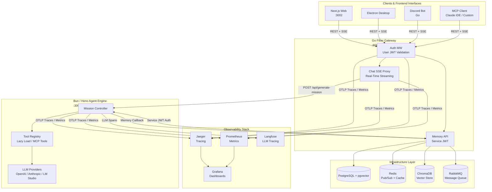

# Echo — Enterprise AI Agent Orchestration Platform


**Echo** is an enterprise-grade, multi-channel AI Agent Orchestration Platform built on a Headless Hardware-as-a-Service (HaaS) architecture. It decouples client frontends, gateway authentication, agent execution engines, and memory infrastructure into resilient, container-native microservices.

---

## 🏛 System Architecture

The following diagram illustrates the component topology, streaming data flows, service-to-service authentication, and observability pipelines across the platform:



---

## ✨ Key Features

- **Multi-Channel Ingestion**: Seamless interaction via Next.js Web UI, Electron Desktop, Discord Bot, or direct Model Context Protocol (MCP) clients.
- **Autonomous Mission Execution**: Asynchronous agent task planning and execution powered by Hono and Bun with lazy-loaded tool registries.
- **Dual JWT Security Architecture**: Strict boundary separation between client-facing User JWT authentication and inter-service Service JWT authorization.
- **Multi-LLM Provider Support**: Dynamic model dispatch supporting OpenAI, Anthropic, and local LLM endpoints (LM Studio, Ollama) via LangChain & LangGraph.
- **Hybrid Memory Architecture**:
  - *Episodic Memory*: Structured database storage via PostgreSQL.
  - *Semantic Memory*: High-dimensional vector search powered by ChromaDB & `pgvector`.
  - *Procedural & Transient Memory*: In-memory cache and real-time Pub/Sub via Redis.
- **Real-Time SSE Streaming**: Native Server-Sent Events (SSE) proxy in Go Gateway for low-latency streaming of agent execution steps.
- **Full Observability Suite**: End-to-end tracing and metric collection with Jaeger, Prometheus, Grafana, and LLM-specific telemetry via Langfuse.

---

## 🛠 Tech Stack

| Component | Technology | Description |
| :--- | :--- | :--- |
| **API Gateway** | Go (1.25) + Fiber v3 | Edge router, JWT auth middleware, SSE proxy, and memory management |
| **Agent Engine** | Bun + Hono + LangChain | High-performance TypeScript agent execution and mission runtime |
| **Web Frontend** | Next.js 16 + React | Modern chat interface, session monitoring, and admin dashboard |
| **Desktop Client** | Electron | Cross-platform desktop application wrapping client workflows |
| **Discord Bot** | Go (`DiscordGo`) | Asynchronous agent interaction bot for Discord channels |
| **Databases** | PostgreSQL (`pgvector`), ChromaDB, Redis | Relational storage, vector embeddings, and transient caching |
| **Message Queue** | RabbitMQ | Asynchronous task distribution and inter-service messaging |
| **Observability** | Jaeger, Prometheus, Grafana, Langfuse | OpenTelemetry tracing, metrics collection, and LLM telemetry |

---

## 🚀 Quick Start

### Prerequisites

Ensure you have the following installed on your machine:
- [Docker & Docker Compose](https://www.docker.com/)
- [Go 1.25+](https://golang.org/)
- [Bun 1.x](https://bun.sh/)
- [Node.js 20+](https://nodejs.org/)

### 1. Clone & Setup Environment

```bash
git clone https://github.com/your-org/echo.git
cd echo
```

### 2. Start Development Environment

Use the root `Makefile` to spin up all infrastructure and containerized services:

```bash
# Start all development containers with hot-reloading
make dev-up
```

To stop the services and clear volumes:

```bash
make dev-down
```

### 🌐 Service Port Matrix

| Service | Host Port | Protocol / Path |
| :--- | :--- | :--- |
| **Next.js Web UI** | `http://localhost:3002` | HTTP Frontend |
| **Go Fiber Gateway** | `http://localhost:8080` | REST API / SSE Proxy |
| **Backend API Docs (Scalar)** | `http://localhost:8080/api/docs` | Interactive OpenAPI Reference |
| **Bun Agent Engine** | `http://localhost:3001` | Internal Agent Service |
| **Agent API Docs (Scalar)** | `http://localhost:3001/docs` | Interactive Agent Reference |
| **Grafana Dashboard** | `http://localhost:3100` | Telemetry Dashboards |
| **Jaeger UI** | `http://localhost:16686` | Distributed Tracing UI |
| **Prometheus** | `http://localhost:9090` | Metrics Explorer |
| **ChromaDB Vector Store** | `http://localhost:8000` | Vector Database |
| **PostgreSQL** | `localhost:5432` | Database Connection |
| **Redis** | `localhost:6379` | Cache / PubSub |

---

## 📖 API Documentation & Deployment

### Interactive Scalar UI
Both services render interactive Scalar API documentation powered by OpenAPI specs:
- **Backend API Docs**: `/api/docs` (OpenAPI JSON: `/api/docs/openapi.json`)
- **Agent API Docs**: `/docs` (OpenAPI JSON spec: `agent/api/openapi.json`)

### Dokploy Post-Deployment Steps
To access API documentation on live production domains:
1. **Domain Setup in Dokploy**:
   - Assign primary backend API domain to `echo-backend` (e.g. `api.yourdomain.com`).
   - Assign agent domain to `echo-agent` (e.g. `agent.yourdomain.com`).
2. **Redeploy Stack**:
   - Trigger production redeployment via Dokploy UI or `make deploy`.
3. **Verify API Docs Access**:
   - Access Backend Scalar Docs at `https://api.yourdomain.com/api/docs`.
   - Access Agent Scalar Docs at `https://agent.yourdomain.com/docs`.

---

## 🏗 Project Structure

```text
echo/
├── agent/                  # Bun + Hono Agent Execution Engine
│   ├── src/                # Mission controller, LLM tools, & LangChain setup
│   └── langfuse/           # Langfuse LLM telemetry configurations
├── backend/                # Go Fiber API Gateway & Core Microservices
│   ├── cmd/                # Entrypoints (server, migrations, seeders)
│   ├── internal/           # Handlers, middleware (JWT), memory services
│   └── migrations/         # PostgreSQL database schema migrations
├── frontend/               # Multi-channel client applications
│   ├── web/                # Next.js 16 web UI (runs on port 3002)
│   ├── dekstop/            # Electron desktop application
│   └── discord/            # Discord bot client
├── infra/                  # Infrastructure configurations (OTEL, Grafana, Prometheus)
├── docs/                   # System documentation & architectural reference
│   ├── assets/screenshots/ # UI screenshots & media assets
│   └── shared/architecture/# High-level architecture guides (Headless HaaS, Coupling)
├── docker-compose.yml      # Base container composition
├── docker-compose.dev.yml  # Development overrides
└── Makefile                # Master command runner (dev-up, prod-up, status)
```

---

## 📸 Screenshots & Demos

> Screenshots of the Web UI, Session Management, and Agent Mission Controller will be stored in [`docs/assets/screenshots/`](docs/assets/screenshots/).

| Web Chat UI | Admin & Session Monitoring |
| :---: | :---: |
| *(Screenshot Placeholder)* | *(Screenshot Placeholder)* |

---

## 📚 Documentation

For in-depth architectural decisions, domain models, and API specifications, consult the [`docs/`](docs/) directory:

- 📑 [Headless HaaS Architecture](docs/shared/architecture/headless-hass.md)
- 📑 [Zero Tight Coupling Guidelines](docs/shared/architecture/zero-tight-coupling.md)
- 📑 [Shared Domain Contracts](docs/shared/contracts/)

---

## 🤝 Contributing

Contributions are welcome! Please follow these guidelines:

1. Fork the repository and create a feature branch (`git checkout -b feature/amazing-feature`).
2. Ensure code compliance with standard formatters (`go fmt`, `bun run lint`).
3. Open a Pull Request detailing the scope of your changes.

---

## 📄 License

*License details to be updated.*
