# Headless Harness as a Service (HaaS) Architecture

This document outlines the architecture, data flows, and design decisions behind the **Headless Harness as a Service (HaaS)**, **Explicit Tool-Binding Isolation**, and **LLM Prefix-Caching Prompt Optimization** patterns implemented across the Hono Agent, Go Gateway, and Next.js Frontend.

---

## 1. Headless HaaS Concept

The system is designed as a **Headless Platform**. The Go Backend acts as a secure API Gateway and Billing/Access controller, while Hono acts as an isolated, stateless Agent Compute Engine. The client (which can be a Next.js UI, mobile app, or a third-party developer API consumer) treats the platform as a black box:
1. Clients discover available capabilities dynamically.
2. Clients dictate the exact boundary of features/tools permitted for a session.
3. The gateway authorizes the request and forwards it to Hono, which dynamically spins up an isolated sandbox.

---

## 2. Dynamic Feature Discovery & Plan Enforcement

To keep the platform performant and secure, tools are not hardcoded on the gateway. Instead, Hono serves as the source of truth for features, which the gateway caches and filters:

```
+------------------+         GET /features         +---------------------+
|                  | ----------------------------> |                     |
|    Go Gateway    |                               |  Hono Agent Engine  |
|  (Fiber Router)  | <---------------------------- | (registry.ts)       |
|                  |     Return ACTIVE_FEATURES    |                     |
+------------------+                               +---------------------+
         |
         v
+------------------+
|   Redis Cache    |  Cache features list (10m TTL) to avoid Hono roundtrips.
|   (10m TTL)      |
+------------------+
         |
         v
+------------------+
|  Tier Filtering  |  If Header "X-User-Tier" == "free", set "locked: true"
|  & Whitelisting  |  on Pro-tier features. Deny `/chat` if Free user requests Pro.
+------------------+
```

---

## 3. Explicit Tool-Binding Isolation

Instead of allowing the Agent model to access all tools (which increases context size, leads to tool-selection confusion, and creates security risks), the client must explicitly pass a `features` array in the request payload.

### Flow & Lifecycle:
1. **Next.js Client**: The user toggles active capabilities (e.g. `["web_search", "web_scrape"]`) in the UI, sending them via `useChatStream` in the stream payload.
2. **Go Gateway**: Validates that all requested tools are unlocked for the user's tier. If valid, forwards `features` to Hono.
3. **Hono Controller**: Safe-parses the payload schema, invokes `toolRegistry.resolveTools(features)` to dynamically import (lazy-load) only the requested modules, and configures the `AgentHarness` with those tools.
4. **Delegation Loops**: Sub-agents spawned in delegation loops inherit the parent harness's bounded tools array to maintain strict boundary isolation.

---

## 4. LLM Prefix-Caching Prompt Optimization

To maximize the Key-Value (KV) cache prefix hit rate on high-performance inference engines (like vLLM, Anthropic, and OpenAI), the system prompts are compiled in a **Static-First, Suffix-Dynamic** sequence:

```
┌────────────────────────────────────────────────────────┐
│ 🟦 BLOCK 1: GLOBAL SYSTEM INSTRUCTIONS (STATIC)        │
│ - Core Persona, ReAct Loop Reasoning Chain rules       │ ──► 100% Cache Hit
│ - Standard SSE JSON Streaming Contract Guidelines      │     (Reused across all users)
└────────────────────────────────────────────────────────┘
                           │
                           ▼
┌────────────────────────────────────────────────────────┐
│ 🟩 BLOCK 2: DYNAMIC FEATURE INJECTIONS (SUFFIX)        │
│ - Active Tool JSON Schemas requested by the payload    │ ──► Cache Boundary Check
│ - CRITICAL: Must be sorted alphabetically by name      │     (Partial match if tools overlap)
└────────────────────────────────────────────────────────┘
                           │
                           ▼
┌────────────────────────────────────────────────────────┐
│ 🟨 BLOCK 3: SESSION VARIABLE CONTEXT (END OF PROMPT)  │
│ - The Current User Query / Objective                   │ ──► Dynamic Tail
│ - Chat History / Previous Conversation Turns           │     (Always computed fresh)
└────────────────────────────────────────────────────────┘
```

### Prefix-Caching Rules Implemented:
* **Alphabetical Tool Sorting**: Bounded tools are sorted alphabetically by `name` before formatting. Identical toolsets always produce identical string templates, matching LLM cache keys.
* **Trailing Objective**: The user's dynamic `{objective}` is appended at the very end of the system prompt so it does not invalidate the preceding static instructions.

---

## 5. End-to-End System Sequence Diagram

```mermaid
sequenceDiagram
    autonumber
    actor Client as Next.js Frontend
    participant Go as Go Gateway (Fiber)
    participant Redis as Redis Cache
    participant Hono as Hono Agent Platform
    participant LLM as LLM Inference Engine

    %% FLOW 1: DYNAMIC FEATURE DISCOVERY
    rect rgb(15, 23, 42)
        Note over Client, Hono: Flow 1: Dynamic Feature Discovery
        Client->>Go: GET /api/v1/features (Header: X-User-Tier)
        Go->>Redis: Check cache key "agent:features"
        alt Cache Hit
            Redis-->>Go: Return JSON tool metadata
        else Cache Miss
            Go->>Hono: GET /api/features (Header: X-Internal-Token)
            Hono-->>Go: Return master ACTIVE_FEATURES array
            Go->>Redis: Set "agent:features" with 10-minute TTL
        end
        Go->>Go: Filter and lock Pro features if X-User-Tier == "free"
        Go-->>Client: Return customized capabilities checklist
    end

    %% FLOW 2: EXPLICIT TOOL-BINDING EXECUTION
    rect rgb(17, 24, 39)
        Note over Client, LLM: Flow 2: Isolated Agent Execution
        Client->>Go: POST /api/v1/chat (Payload: { message, features: [...] })
        Go->>Go: Validate requested features against User Tier (Reject if Free user requests Pro)
        Go->>Hono: POST /api/generate-mission (Payload: { prompt, features, strategy })
        
        Hono->>Hono: schema.safeParse(payload)
        Hono->>Hono: registry.resolveTools(features) (Lazy load explicitly bound tools)
        Hono->>Hono: Instantiate AgentHarness with isolated tools only
        
        loop ReAct / NLAH Loop
            %% FLOW 3: CACHE-FRIENDLY PROMPT COMPILATION
            rect rgb(30, 41, 59)
                Note over Hono, LLM: Flow 3: LLM Prefix-Caching Compiler
                Hono->>Hono: Clone & sort active tools list alphabetically
                Hono->>Hono: Assemble prompt: Static Instructions -> Bounded Tools -> Objective (Trailing Suffix)
            end
            Hono->>LLM: stream(systemPrompt, messages, sortedTools)
            LLM-->>Hono: Stream tokens / Tool calls (SSE chunked)
            alt Model requests Tool Call
                Hono->>Hono: Execute sandboxed tool (Only if tool was explicitly bound)
            end
            Hono-->>Go: Stream SSE Packets (e.g. swarm_status, reasoning, content)
            Go-->>Client: Proxy SSE Packets to Frontend UI
        end
    end
```



---

## 6. Implementation Code Files Reference

- **Frontend Client Features Hook**: [useFeatures.ts](file:///c:/programming/echo/frontend/web/src/features/chat/api/useFeatures.ts)
- **Frontend Chat Stream Connection**: [useChatStream.ts](file:///c:/programming/echo/frontend/web/src/features/chat/api/useChatStream.ts)
- **Go Gateway Routes**: [router.go](file:///c:/programming/echo/backend/internal/router/router.go)
- **Go Gateway Handlers**: [chat_handler.go](file:///c:/programming/echo/backend/internal/handler/chat_handler.go)
- **Hono Lazy-Loading Registry**: [registry.ts](file:///c:/programming/echo/agent/src/core/agent/tools/registry.ts)
- **Hono Strategy Prompts**: [prompts.ts](file:///c:/programming/echo/agent/src/core/agent/strategies/prompts.ts)
- **Hono NLAH Strategy**: [nlah.ts](file:///c:/programming/echo/agent/src/core/agent/strategies/nlah.ts)
- **Hono ReAct Strategy**: [re-act.ts](file:///c:/programming/echo/agent/src/core/agent/strategies/re-act.ts)
